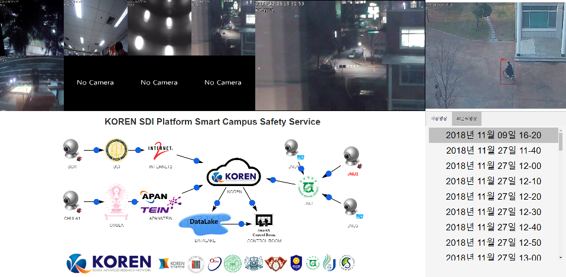

# Smart Campus Safety Service

## 1. 전체 구상

## 2. Control Room에서 관제 UI

 Smart Campus Safety CCTV 서비스의 Control Room에서는 분산된 CCTV의 통합 관제를 위한 시각화 및 각 CCTV의 구체적 정보 확인을 위한 시각화가 필요하다. 또한, 간단한 영상 데이터 분석 결과를 확인하기 위한 시각화를 제공할 수도 있다.
 
 통합 관제 시각화를 위해서 분산되어 설치된 다수의 CCTV에서 제공되는 영상데이터를 통합된 UI를 통해 표현한다. 

Cbox 속의 CCTV 관리 프로그램인 Kerberos.io, Zonminder를 통해 각 CCTV의 Rtsp 주소를 http 주소로 변경한다. Control Room의 Web Server에서는 변경된 http를 통해 CCTV 영상을 출력한다.

또한, Network Topology를 통해 등록된 기관과 CCTV를 한 눈에 볼 수 있다.
 
 ## 3. 기능
 ### 3.1. CCTV Visualization
 UI에서 CCTV 영상을 한 눈에 볼 수 있다. 영상이나 Network Topology 속 CCTV 이미지 클릭을 통해 더 영상을 크게 확대하여 볼 수 있다.
 
 ### 3.2. Network Topology
 현재 등록된 기관 및 CCTV를 한 눈에 볼 수 있는 망형 구조의 트리이다. 각 기관에서 카메라 추가/제거 기능 및 각 카메라에서 카메라 제거, 저장된 영상 그리고 CCTV 영상에 따른 Dashboard를 볼 수 있는 기능을 구현했다.

 ### 3.3. 저장 영상 및 AI분석 영상 출력
 건국대 측에서 각 CCTV의 영상을 10분 단위로 나누어 Datalake에 저장한다. 성균관대 측에서는 10분 단위로 나누어진 영상에 이상현상이 일어나는지 분석하고, 이상현상이 감지되는 영상에 한하여 Datalake에 추가로 저장한다.
 
  Control Room의 UI에서는 이 영상들을 각 기관의 카메라 그리고 날짜에 따라 분류하여  수 있다.
