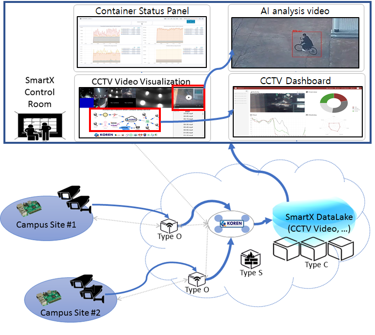

# Smart Campus Safety Service

## 전체 구상

## Control Room에서 관제 UI

 Smart Campus Safety CCTV 서비스의 Control Room에서는 분산된 CCTV의 통합 관제를 위한 시각화 및 각 CCTV의 구체적 정보 확인을 위한 시각화가 필요하다. 또한, 간단한 영상 데이터 분석 결과를 확인하기 위한 시각화를 제공할 수도 있다.
 
 통합 관제 시각화를 위해서 분산되어 설치된 다수의 CCTV에서 제공되는 영상데이터를 통합된 UI를 통해 표현한다. 

Cbox 속의 CCTV 관리 프로그램인 Kerberos.io, Zonminder를 통해 각 CCTV의 Rtsp 주소를 http 주소로 변경한다. Control Room의 Web Server에서는 변경된 http를 통해 CCTV 영상을 출력한다.

또한, Network Topology를 통해 등록된 기관과 CCTV를 한 눈에 볼 수 있다.
 
 ## 1. 기능
 ### 1.1. CCTV Visualization
  CCTV 영상을 받아와 
