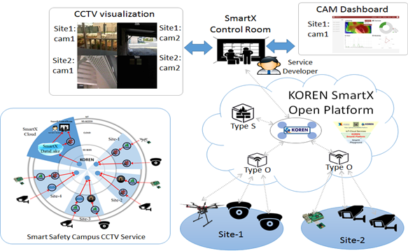

# Demo_Visualization

###  - Smart Campus Safety CCTV 서비스의 Control Room에서는 분산된 CCTV의 통합 관제를 위한 시각화 및 각 CCTV의 구체적 정보 확인을 위한 시각화가 필요하다. 또한, 간단한 영상 데이터 분석 결과를 확인하기 위한 시각화를 제공할 수도 있다.
###  - 통합 관제 시각화를 위해서 분산되어 설치된 다수의 CCTV에서 제공되는 영상데이터를 통합된 UI를 통해 표현한다. VLC 또는 IP Camera viewer등을 활용해 통합된 영상데이터 시각화를 수행하고, 서비스 운용자의 관심영역을 능동적으로 파악하여 시각화하는 기능을 제공할 수 있다.
###  - Type O Box에 구성된 CCTV관리 프로그램에서 제공하는 각 CCTV의 통계적 분석 결과 및 움직임 감지와 같은 간단한 영상데이터 분석결과를 표현할 수 있는 시각화 UI를 제공한다.
